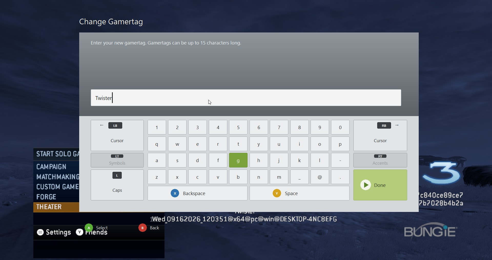

# PC Virtual Keyboard (Xbox 360 Style)

A Win32 virtual keyboard that recreates the classic Xbox 360 / Xbox Live Guide on-screen keyboard. Designed as a drop-in overlay for games and applications that need controller-friendly text input on PC.



## Features

- **Xbox 360 aesthetic** – matching layout, colors, face-button badges, and side controls
- **Full controller support** via XInput (D-pad, left stick, A/B/X/Y, LB/RB, LT/RT, Start, Left Stick click)
- **Mouse + keyboard** support as well
- **Transparent overlay** – uses layered window + color-key so only the UI is visible
- **Scales to any resolution** – all layout is defined in a 1280×720 reference space and scaled with `MulDiv`
- **Overlapped / async API** – similar style to the original Xbox Online Guide virtual keyboard calls
- **Caps lock**, caret movement, backspace, space, and Done
- Symbols / Accents buttons are present (currently disabled / non-functional placeholders)

## Controls

| Input | Action |
|-------|--------|
| **A** / Enter / Left Click | Select / activate focused key |
| **B** / Esc | Cancel / close |
| **X** | Backspace |
| **Y** | Space |
| **LB** / **RB** | Move caret left / right |
| **Left Stick Click** | Toggle Caps |
| **Start** | Done |
| **D-pad / Left Stick** | Move focus between keys |
| **Arrow keys** | Move focus (Ctrl+Left/Right moves caret) |

## Building

### Requirements

- Windows 10/11
- CMake ≥ 3.20
- Visual Studio 2019/2022 (or any C++17 compiler that can target Win32)
- Windows SDK (for `user32`, `gdi32`, `msimg32`, `xinput`)

### Build (CMake Presets)

```bash
# Configure + build Release (Ninja)
cmake --preset x64-release
cmake --build --preset x64-release

# Or Debug
cmake --preset x64-debug
cmake --build --preset x64-debug

# Visual Studio 2026 solution
cmake --preset vs2026-x64
cmake --build --preset vs2026-x64-release

# Visual Studio 2022 solution
cmake --preset vs2022-x64
cmake --build --preset vs2022-x64-release
```

Available configure presets: `x64-debug`, `x64-release`, `x64-relwithdebinfo`, `vs2026-x64`, `vs2022-x64`, `vs2019-x64`.

You can also open the folder in Visual Studio / VS Code and select a preset from the CMake Tools UI.

The CMakeLists produces a single executable:

```
pc_virtual_keyboard.exe
```

## Usage / API

The main entry point is:

```cpp
unsigned long online_guide_show_virtual_keyboard_ui(
    int controller_index,               // 0–3
    unsigned long character_flags,      // currently unused
    wchar_t const* default_text,
    wchar_t const* title_text,
    wchar_t const* description_text,
    wchar_t* result_text,               // output buffer
    unsigned long maximum_character_count,
    OVERLAPPED* platform_handle);       // async completion
```

- Returns `ERROR_IO_PENDING` on success (keyboard is shown).
- When the user presses **Done** the result is written into `result_text` and the overlapped event is signaled with `ERROR_SUCCESS`.
- When the user presses **B** / Esc the overlapped is completed with `ERROR_CANCELLED`.

A simple `wWinMain` demo is included that opens the keyboard with the title “Change Gamertag”.

## Layout Notes

All coordinates are defined against a **1280 × 720** reference resolution and scaled at runtime. Key constants live at the top of `virtual_keyboard_overlapped.cpp`:

- Panel, input field, letter keys, side buttons (Cursor / Caps / Symbols / Accents), Backspace, Space, and Done
- Left and right side columns use matching outer padding (30 px) and inner gaps (10 px)
- Backspace + Space together span the full width of the letter-key area

## Project Structure

```
├── CMakeLists.txt
├── CMakePresets.json
├── virtual_keyboard_overlapped.cpp   # all implementation
└── README.md
```

## License

This project is provided as-is for educational and integration purposes.  
Xbox, Xbox 360, and related terms are trademarks of Microsoft Corporation.
